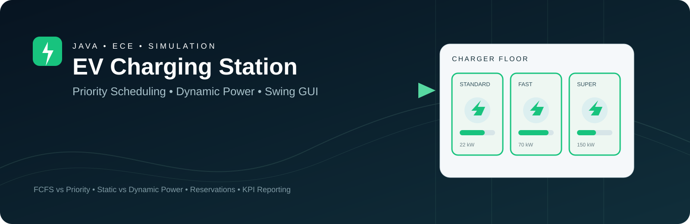
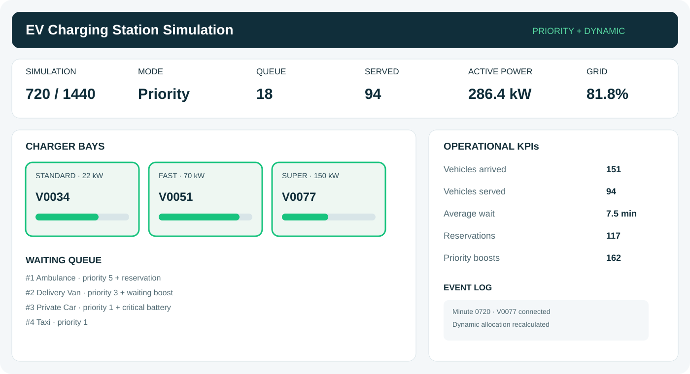
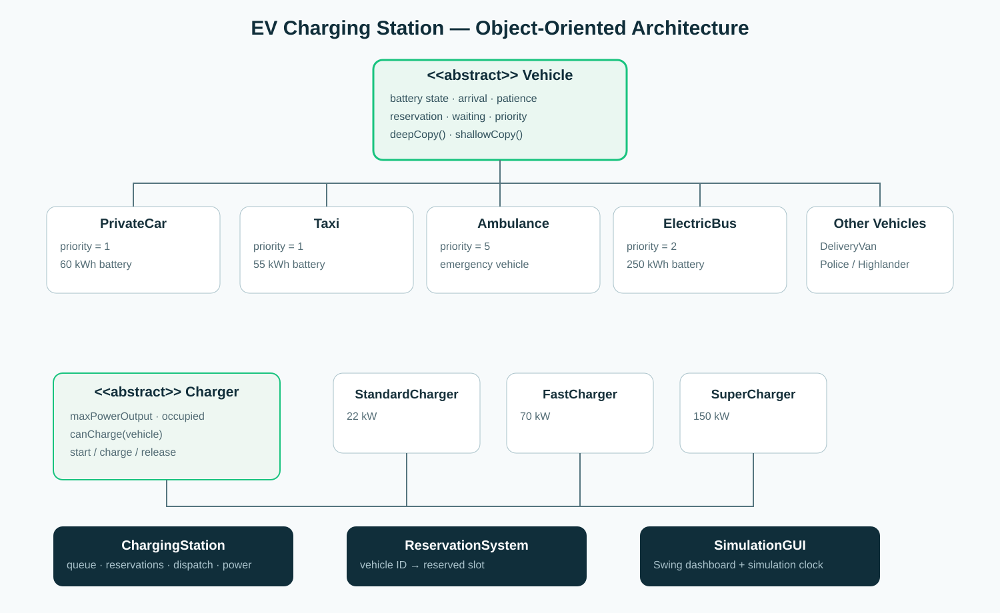

# EV Charging Station Simulation

<div align="center">



A Java-based simulation that compares <strong>FCFS + Static Power</strong> with <strong>Priority Scheduling + Dynamic Power Allocation</strong> under a realistic one-day EV charging workload.

</div>

<p align="center">
  
  
  
  
  
</p>

---

## Overview

This project models a busy EV charging station where heterogeneous vehicles compete for a limited number of charging bays and a constrained grid-power budget.

The project is designed as an **Advanced Java / Object-Oriented Programming** system rather than a simple GUI exercise. It combines object-oriented modeling, scheduling policies, reservation management, charging compatibility, resource allocation, deterministic simulation, Swing visualization, regression testing, and continuous integration.

The station is evaluated under two strategies using the same deterministic workload:

| Mode | Scheduling | Power Allocation |
|---|---|---|
| **Phase 1** | First-Come, First-Served (FCFS) | Static |
| **Phase 2** | Priority-based | Dynamic |

> **Course:** EE364 — Advanced Java  
> **Institution:** King Abdulaziz University  
> **Department:** Electrical & Computer Engineering

## Why This Project Matters

The engineering question is not simply whether vehicles can charge. The project asks how scheduling and resource-allocation policies affect a constrained charging station when demand is uneven and vehicle priorities differ.

```text
EV charging workload
        ↓
Vehicle / charger modeling
        ↓
Scheduling policy
        ↓
Power allocation
        ↓
Minute-by-minute simulation
        ↓
Operational metrics
        ↓
Strategy comparison
```

## Advanced Java Concepts

| Concept | Implementation |
|---|---|
| **Abstraction** | `Vehicle` and `Charger` abstractions |
| **Inheritance** | Multiple concrete vehicle and charger subclasses |
| **Polymorphism** | Type-specific priority and compatibility behavior |
| **Interfaces** | `Prioritizable`, `HighVoltageCapable` |
| **Encapsulation** | Private state with controlled domain methods |
| **Collections** | `List`, `Queue`, `Map` and standard-library collections |
| **Copy semantics** | Shallow/deep-copy behavior |
| **GUI** | Java Swing dashboard |
| **Simulation** | 1,440-minute deterministic workload |
| **Scheduling** | FCFS vs priority dispatch |
| **Resource allocation** | Static vs dynamic charging power |
| **Testing** | Standard-library regression test suite |
| **CI** | GitHub Actions compile, test, and smoke-test workflow |

## System Architecture

### Vehicle Layer

The abstract `Vehicle` model captures common battery state, arrival time, charging requirements, reservation state, waiting time, and priority information.

Concrete vehicle types include `PrivateCar`, `Taxi`, `DeliveryVan`, `PoliceVehicle`, `Ambulance`, `ElectricBus`, and `Highlander`.

### Charger Layer

| Charger | Maximum Power |
|---|---:|
| Standard Charger | 22 kW |
| Fast Charger | 70 kW |
| Super Charger | 150 kW |

`FastCharger` and `SuperCharger` implement `HighVoltageCapable`.

### Station Layer

`ChargingStation` coordinates arriving vehicles, charger compatibility, queueing, reservations, charging progression, grid constraints, scheduling policy, and operational statistics.

`ReservationSystem` manages reserved charging slots and validates reservation access.

## Scheduling & Priority

### Phase 1 — FCFS + Static Power

Vehicles are considered in arrival order while charging power follows the baseline static allocation policy.

### Phase 2 — Priority + Dynamic Power

The station considers effective priority, charger compatibility, reservations, battery criticality, and waiting time.

Waiting-time boosts are applied at configured thresholds:

- 20 minutes → +1 priority
- 40 minutes → +2 priority
- 60 minutes → +3 maximum

## Simulation Model

The console simulation represents **1,440 minutes** of station operation. A deterministic seed is used so both strategies receive the same workload, making the comparison reproducible.

### Verified Local Run

Using seed `3642034`:

| Metric | Phase 1 | Phase 2 |
|---|---:|---:|
| Vehicles arrived | 303 | 303 |
| Vehicles served | 151 | 187 |
| Lost customers | 146 | 116 |
| Critical incidents | 42 | 32 |
| Average wait | 28.6 min | 7.5 min |
| Grid utilization | 68.9% | 86.0% |
| Reservations | 0 | 117 |
| Priority boosts | 0 | 162 |

**Observation:** the priority + dynamic strategy served 36 more vehicles and reduced average waiting time by 21.2 minutes, while increasing grid utilization by 17.1 percentage points.

## GUI & Architecture Preview

The Swing dashboard visualizes the simulation clock, queue, served vehicles, active power, grid utilization, scheduling mode, and event activity.



The project architecture is organized around vehicle and charger abstractions, specialized subclasses, station orchestration, and a reservation service.



## Project Structure

```text
EV-Charging-Station-Simulation/
├── README.md
├── .gitignore
├── assets/
│   ├── project-banner.svg
│   └── dashboard-preview.svg
├── docs/
│   ├── README.md
│   └── uml-class-diagram.svg
├── src/
│   └── evcharging/
│       ├── Ambulance.java
│       ├── Charger.java
│       ├── ChargingStation.java
│       ├── ChargingStationMode.java
│       ├── DeliveryVan.java
│       ├── ElectricBus.java
│       ├── FastCharger.java
│       ├── HighVoltageCapable.java
│       ├── Highlander.java
│       ├── Main.java
│       ├── PoliceVehicle.java
│       ├── Prioritizable.java
│       ├── PrivateCar.java
│       ├── ReservationSystem.java
│       ├── SimulationGUI.java
│       ├── StandardCharger.java
│       ├── SuperCharger.java
│       ├── Taxi.java
│       └── Vehicle.java
├── tests/
│   └── DSATest.java
└── .github/
    └── workflows/
        └── ci.yml
```

## Requirements

- **JDK 17+**
- Java Swing (included with the standard JDK)
- No third-party libraries

## Run Locally

### Compile

```bash
mkdir -p build/classes
javac -d build/classes $(find src -name '*.java')
```

### Console simulation

```bash
java -cp build/classes evcharging.Main 3642034
```

### GUI

```bash
java -cp build/classes evcharging.SimulationGUI
```

### Tests

```bash
javac -d build/classes $(find src tests -name '*.java')
java -cp build/classes tests.DSATest
```

GitHub Actions runs the same compile/test flow and performs a console-simulation smoke test on pushes and pull requests to `main`.

## Testing & CI

The regression suite covers vehicle priority and copy behavior, reservation creation and validation, charger compatibility, station phase configuration, and station state progression.

## Engineering Takeaways

This project demonstrates practical application of object-oriented architecture, inheritance, polymorphism, interfaces, queueing and priority scheduling, constrained resource allocation, deterministic simulation, Swing visualization, regression testing, and continuous integration.

## Academic Materials

The original proposal, presentation, and other submission artifacts are intentionally excluded from the public repository when they contain student-identification data. This repository keeps the technical implementation, architecture diagrams, and automated verification material.

## Team

- Abdulaziz Alzahrani — GUI & Coding
- Abdullah Almutiri — Report Writing & Coding
- Abdulaziz Alqassab — Presentation & Coding
- Ali Almalki — GUI & Coding

## License

Academic team project for EE364 at King Abdulaziz University. No open-source license is currently declared.
